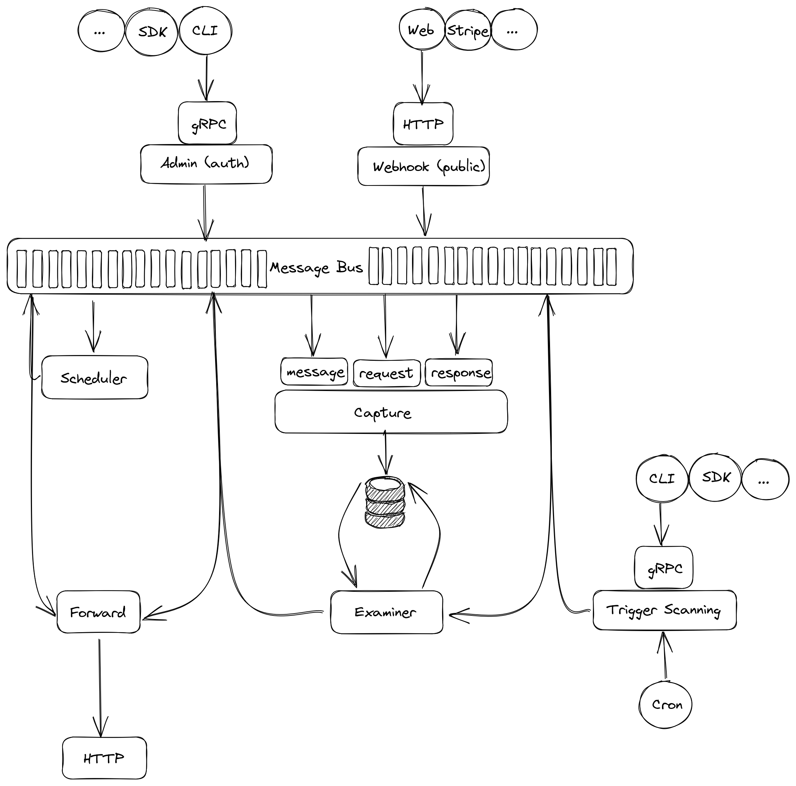

# @scrapnode/scraphook

> Empower your applications with lightning-fast webhooks: Reliable, scalable, and easy for developers to integrate.

## Get Started

- Start all local services by script `./scripts/local_start.sh`
- Test service with command `curl -X POST -d '{"username":"tuannguyen"}' http://localhost:8080/hooks/wh_demo?wh.verify_token=notsimpleasyouthought`